```mermaid
flowchart LR
    subgraph Browser[Browser / user trust boundary]
        User[Human user]
    end

    subgraph Entra[Microsoft Entra ID trust boundary]
        SignIn[Single-tenant sign-in]
        Claims[Authenticated user claims and app roles]
    end

    subgraph AppService[Azure App Service application trust boundary]
        App[ASP.NET Core Razor Pages]
        AuthN[Validate authenticated user]
        AuthZ[Authorize /Notes with SecretNotes.Reader]
        Catalog[Select approved logical note identifier]
        SecretClient[SecretClient using DefaultAzureCredential]
        MI[System-assigned Managed Identity]
    end

    subgraph KeyVault[Azure Key Vault data-plane trust boundary]
        RBAC[Azure RBAC authorizes Managed Identity]
        Secret[Approved synthetic secret]
    end

    User -->|authenticate| SignIn
    SignIn --> Claims
    Claims -->|token for application only| App
    App --> AuthN --> AuthZ
    AuthZ -->|authorized request| Catalog --> SecretClient
    SecretClient -->|workload authentication| MI
    MI -->|read secret| RBAC --> Secret
    Secret -->|secret value returned to application| SecretClient
```

# Architecture

## Logical architecture

Secret Notes Viewer Lite is planned as a small ASP.NET Core Razor Pages application hosted on Azure App Service. It will authenticate users with a single Microsoft Entra ID tenant, authorize access to `/Notes` with the configured `SecretNotes.Reader` app role, and retrieve a closed catalog of synthetic demonstration note secrets from Azure Key Vault by using the App Service system-assigned Managed Identity.

The human user never accesses Azure Key Vault directly. The web application is the policy enforcement point for user authorization, and the Managed Identity is the workload identity that calls Key Vault.

## Actors and Azure components

- **User:** A human browser user who may be anonymous, authenticated without the app role, or authenticated with `SecretNotes.Reader`.
- **Microsoft Entra ID:** The single-tenant identity provider for user authentication and app-role claims.
- **ASP.NET Core Razor Pages:** The planned web application and user authorization enforcement point.
- **Azure App Service:** The planned hosting platform for the Razor Pages application.
- **System-assigned Managed Identity:** The workload identity attached to App Service and used by the application to authenticate to Azure Key Vault.
- **Azure Key Vault:** The planned secret store for synthetic demonstration note values.
- **Azure RBAC:** The authorization system used to grant the Managed Identity data-plane access to Key Vault secrets.

## Development identity bootstrap

The development identity metadata now exists, while application runtime authentication remains deferred:

- **Application object / App Registration:** The development-specific `Secret Notes Viewer Lite - Development` App Registration defines the single-tenant identity-platform configuration, localhost HTTPS callbacks, `SecretNotes.Reader` app role, ownership, and credential registrations. No credential or API permission is configured.
- **Service principal / Enterprise Application:** The corresponding Enterprise Application represents the application in the tenant. Assignment is required, it is hidden from My Apps, and it holds tenant-local assignments.
- **Human authorization:** One individual human user is assigned to the `Secret Notes Reader` role for development validation. The role authorizes only the future application feature; authentication middleware, the authorization policy, and `/Notes` are not implemented yet.
- **Future workload identity:** A future App Service system-assigned Managed Identity will call Azure Key Vault. Neither the assigned human user nor the human user's Entra token is the Key Vault caller.

The existing registration is development-specific and contains localhost HTTPS endpoints only. A separate production App Registration will be created in a future deployment milestone. Production App Service endpoints must not be added to the development registration, and development and production credential lifecycles must remain separate.

## Planned authentication flow

1. The user requests the application.
2. The application redirects unauthenticated users to Microsoft Entra ID.
3. Microsoft Entra ID authenticates the user in the configured single tenant.
4. The application receives and validates the authentication result through Microsoft.Identity.Web.

Authentication proves who the human user is. It does not grant direct Key Vault access.

## Planned authorization flow

1. A user requests `/Notes`.
2. The application evaluates an authorization policy that requires the `SecretNotes.Reader` app role.
3. Anonymous users are challenged to sign in.
4. Authenticated users without the app role are denied.
5. Authenticated users with `SecretNotes.Reader` may use the application feature that displays approved synthetic notes.

The app role authorizes the user to use the application feature only. It does not authorize the user to call Key Vault.

## Key Vault access flow

1. The `/Notes` page selects a secret from an application-owned, closed catalog of known secret names.
2. The application creates an Azure SDK `SecretClient` using `DefaultAzureCredential`.
3. In Azure App Service, `DefaultAzureCredential` uses the system-assigned Managed Identity.
4. Azure Key Vault authorizes the Managed Identity through Azure RBAC.
5. The Managed Identity is expected to receive only the `Key Vault Secrets User` role scoped as narrowly as practical.
6. The application displays only the intended synthetic note value and never logs, echoes, or stores the secret value elsewhere.

Users must not provide arbitrary secret names, query strings, or route values that are passed to Key Vault.

## Trust boundaries

- **Browser to application:** Untrusted user input crosses into the application and must be validated.
- **Application to Microsoft Entra ID:** Authentication depends on configured tenant and application registration metadata.
- **Application authorization boundary:** `/Notes` requires `SecretNotes.Reader` before any note retrieval is attempted.
- **Application to Azure Key Vault:** Only the workload identity crosses this boundary; the human user's token is not used for Key Vault access.
- **Operational evidence boundary:** Screenshots, logs, terminal output, Issues, and pull requests must not contain secret values or sensitive identifiers.

## Human identity vs. workload identity

Human identity and workload identity are intentionally separate:

- The human identity authenticates to the application with Microsoft Entra ID.
- The human identity is authorized inside the application with `SecretNotes.Reader`.
- The App Service Managed Identity authenticates the workload to Azure Key Vault.
- Azure RBAC authorizes the Managed Identity, not the human user, to read approved secrets.

## Planned Azure resources

- Azure Resource Group.
- Azure App Service Plan sized for low-cost learning usage.
- Azure App Service with a system-assigned Managed Identity.
- Azure Key Vault configured for Azure RBAC.
- Application Insights connected to a Log Analytics workspace, with implementation deferred to a later milestone and conservative telemetry, sampling, retention, and cost controls.

## Non-sensitive application configuration

Non-secret identifiers may be supplied as runtime configuration, including through Azure App Service configuration. These include tenant ID, application/client ID, Key Vault URI, environment name, logical note identifiers such as `release-note`, and feature flags. Real identifier values should still not be unnecessarily published in README files, Issues, pull requests, screenshots, videos, or terminal evidence. Sensitive values such as client secrets, passwords, access tokens, refresh tokens, credentials, secret values, sensitive connection strings, and personal data must never be committed or exposed.

## Architectural restrictions

- No direct user access to Azure Key Vault.
- No arbitrary secret-name lookup, enumeration, wildcard reads, or user-controlled Key Vault identifiers.
- No storage of secret values in source control, App Settings, logs, exceptions, telemetry, URLs, screenshots, videos, Issues, pull requests, or terminal evidence.
- This documentation milestone changes no application code, tests, infrastructure, scripts, workflows, deployment configuration, Azure resources, or Entra ID resources; it records the already-completed manual development identity bootstrap.
