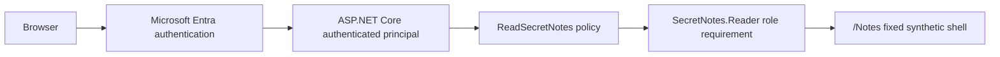

# Architecture

## Implemented application flow

Secret Notes Viewer Lite is an ASP.NET Core Razor Pages application. Microsoft.Identity.Web implements single-tenant Microsoft Entra authentication. B4-D5 adds the first application-owned authorization boundary and a protected, fixed synthetic Notes shell.

```text
Browser
→ Microsoft Entra authentication
→ ASP.NET Core authenticated principal
→ ReadSecretNotes policy
→ SecretNotes.Reader role requirement
→ /Notes synthetic shell
```

The home page, Privacy page, and health endpoint remain public. `/Notes` is the only protected application page in this milestone.



## Authentication and authorization

Authentication establishes the browser user's application principal. The existing OpenID Connect Authorization Code Flow, PKCE behavior, token saving needed for the session lifecycle, and sign-out callback remain unchanged.

Authorization is separate. The `ReadSecretNotes` policy requires the `SecretNotes.Reader` role. An anonymous request is challenged, an authenticated principal without the role is forbidden, and a principal with the role may render the Notes shell. The authenticated navigation link is not an authorization control.

The application does not render roles, claims, names, email addresses, identifiers, tokens, or authentication properties.

## Development identity

The existing development App Registration remains single tenant and defines the localhost HTTPS callbacks and `SecretNotes.Reader` app role for `Users/Groups`. The corresponding Enterprise Application requires assignment. One assigned real user is reserved for successful local validation; automated negative cases use synthetic principals and do not change any Entra object or assignment.

Local confidential-client authentication continues to use the existing short-lived client secret stored outside the repository in .NET User Secrets. No registration, redirect URI, logout URL, credential, role, assignment, user, or group is created or changed by B4-D5.

## Protected Notes shell

The `/Notes` page contains exactly three fixed synthetic note labels and a Key Vault deferral statement. It has no application service, data access, API endpoint, arbitrary lookup, route parameter, query parameter, form input, persistence, or write operation.

The PageModel applies no-store response-cache behavior so authorized responses are not intended to be cached.

## Test architecture

The integration test project hosts the real application through `WebApplicationFactory<Program>`. Only the test process replaces the default authentication scheme with a deterministic handler that creates non-identifying synthetic principals. Production code has no dependency on the test project, reads no test headers, and contains no authentication or authorization bypass.

Tests exercise the application through HTTP and cover public endpoints, anonymous challenge, missing and unrelated role denial, authorized access, fixed content, identity non-disclosure, and no-store behavior.

## Human identity and future workload identity

The human identity authenticates to the application and is authorized inside the application. The application role grants no Azure permission.

The future workload identity remains separate:

```text
/Notes
→ application service
→ Managed Identity
→ Key Vault
```

That flow is deferred and is not present in application code. Human users will not call Key Vault directly; a future App Service Managed Identity is intended to become the Key Vault caller.

## Deferred Key Vault flow

Future work may add an application-owned closed catalog and application service, then use a system-assigned Managed Identity to authenticate to Key Vault. Azure RBAC would authorize that workload identity with narrowly scoped read access.

No Azure SDK, `SecretClient`, `DefaultAzureCredential`, Key Vault abstraction, Managed Identity, Azure RBAC assignment, deployment resource, infrastructure definition, or CI/CD workflow is implemented in B4-D5.

Planned resources still include an App Service, a system-assigned Managed Identity, and a Key Vault configured for Azure RBAC. Their design and provisioning belong to later milestones, along with telemetry and deployment automation.

## Trust boundaries

- Browser to Microsoft Entra and application: existing authentication validates the session without rendering identity details.
- Application authorization: `/Notes` evaluates `ReadSecretNotes` before rendering protected content.
- Test to production: synthetic authentication remains entirely in the integration test assembly.
- Future application to Key Vault: deferred; only a workload identity will cross this boundary.
- Operational evidence: secrets, credentials, tokens, claims, personal information, and real identifiers must not be captured.

## Architectural restrictions

- No direct human access to Key Vault through the application role.
- No arbitrary note selection, enumeration, search, route input, query input, or write operation.
- No secret values in source, configuration, logs, exceptions, telemetry, URLs, screenshots, tests, Issues, or pull requests.
- No fallback or global authorization policy; protection is explicit on the Notes PageModel.
- No production test scheme, test header handling, custom claims transformation, or environment authorization bypass.
