# Architecture

## Logical architecture

Secret Notes Viewer Lite is a small ASP.NET Core Razor Pages application planned for future hosting on Azure App Service. It authenticates users with a single Microsoft Entra ID tenant and authorizes access to `/Notes` with the configured `SecretNotes.Reader` app role. The application owns a closed catalog of logical note identifiers and display names. The target architecture will resolve those logical identifiers to synthetic demonstration note secrets in Azure Key Vault by using the App Service system-assigned Managed Identity.

The human user never accesses Azure Key Vault directly. The web application is the policy enforcement point for user authorization, and the future Managed Identity is the workload identity that will call Key Vault.

### Deferred target state

The complete diagram below is the deferred target state. App Service deployment, the Key Vault provider adapter and logical-to-physical mapping, `SecretClient`, `DefaultAzureCredential`, Managed Identity, Key Vault, Azure RBAC, telemetry, and CI/CD are not implemented in B4-D6.

```mermaid
flowchart LR
    subgraph Browser[Browser / user trust boundary]
        User[Human user]
    end

    subgraph Entra[Microsoft Entra ID trust boundary]
        SignIn[Single-tenant sign-in]
        Claims[Authenticated user claims and app roles]
    end

    subgraph AppService[Azure App Service application trust boundary]
        App[ASP.NET Core Razor Pages]
        AuthN[Validate authenticated user]
        AuthZ[Authorize /Notes with SecretNotes.Reader]
        Catalog[Select approved logical note identifier]
        SecretClient[SecretClient using DefaultAzureCredential]
        MI[System-assigned Managed Identity]
    end

    subgraph KeyVault[Azure Key Vault data-plane trust boundary]
        RBAC[Azure RBAC authorizes Managed Identity]
        Secret[Approved synthetic secret]
    end

    User -->|authenticate| SignIn
    SignIn --> Claims
    Claims -->|token for application only| App
    App --> AuthN --> AuthZ
    AuthZ -->|authorized request| Catalog --> SecretClient
    SecretClient -->|workload authentication| MI
    MI -->|read secret| RBAC --> Secret
    Secret -->|secret value returned to application| SecretClient
```



## Implemented B4-D6 flow

Microsoft Entra authentication, OpenID Connect Authorization Code Flow, PKCE, and the B4-D5 authorization boundary remain implemented. B4-D6 moves the catalog and synthetic content out of Razor markup:

```text
Browser
→ Microsoft Entra authentication
→ ASP.NET Core authenticated principal
→ ReadSecretNotes policy
→ SecretNotes.Reader role requirement
→ Notes PageModel
→ IReadNotesService
→ ClosedNoteCatalog
→ INoteContentProvider
→ InMemoryNoteContentProvider
→ NoteItem models
→ Razor rendering
```

`ReadSecretNotes` requires `SecretNotes.Reader`. Anonymous requests to `/Notes` are challenged, authenticated users without the required role are forbidden, and authenticated users with the role can execute the notes service and render the fixed catalog. The authenticated Notes navigation link is a convenience, not the authorization boundary; the server-side PageModel policy is the boundary.

`ClosedNoteCatalog` owns membership, order, and display names. `ReadNotesService` requests content only for those definitions, and `INoteContentProvider` accepts only the closed `NoteId` value type. The provider cannot enumerate notes, raw identifier strings never reach it, and Razor accepts no identifier input. Logical IDs are not physical Key Vault names.

The Notes PageModel applies zero-duration, no-location, no-store response-cache behavior. Query strings cannot alter or expand the catalog. Integration tests exercise the boundary with non-identifying synthetic principals only. The synthetic authentication scheme exists only in the integration-test assembly, and production contains no test authentication bypass or test-header handling.

## Actors and Azure components

- **User:** A human browser user who may be anonymous, authenticated without the app role, or authenticated with `SecretNotes.Reader`.
- **Microsoft Entra ID:** The single-tenant identity provider for user authentication and app-role claims.
- **ASP.NET Core Razor Pages:** The planned web application and user authorization enforcement point.
- **Azure App Service:** The planned hosting platform for the Razor Pages application.
- **System-assigned Managed Identity:** The workload identity attached to App Service and used by the application to authenticate to Azure Key Vault.
- **Azure Key Vault:** The planned secret store for synthetic demonstration note values.
- **Azure RBAC:** The authorization system used to grant the Managed Identity data-plane access to Key Vault secrets.

## Development identity bootstrap

The development identity metadata and local application authentication are implemented:

- **Application object / App Registration:** The development-specific `Secret Notes Viewer Lite - Development` App Registration defines the single-tenant identity-platform configuration, localhost HTTPS callbacks, `SecretNotes.Reader` app role, ownership, and credential registrations. One short-lived development-only client credential supports the local confidential-client flow; no API permission is configured.
- **Service principal / Enterprise Application:** The corresponding Enterprise Application represents the application in the tenant. Assignment is required, it is hidden from My Apps, and it holds tenant-local assignments.
- **Human authorization:** One individual human user is assigned to the `Secret Notes Reader` role for development validation. The implemented `ReadSecretNotes` policy uses that app-role value to authorize the `/Notes` fixed synthetic shell.
- **Future workload identity:** A future App Service system-assigned Managed Identity will call Azure Key Vault. Neither the assigned human user nor the human user's Entra token is the Key Vault caller.

The existing registration is development-specific and contains localhost HTTPS endpoints only. A separate production App Registration will be created in a future deployment milestone. Production App Service endpoints must not be added to the development registration, and development and production credential lifecycles must remain separate.

## Implemented authentication flow

1. The user requests the application.
2. The application redirects unauthenticated users to Microsoft Entra ID.
3. Microsoft Entra ID authenticates the user in the configured single tenant.
4. The application receives and validates the authentication result through Microsoft.Identity.Web.

Authentication proves who the human user is. It does not grant direct Key Vault access.

## Implemented authorization flow

1. A user requests `/Notes`.
2. The application evaluates the `ReadSecretNotes` authorization policy, which requires the `SecretNotes.Reader` app role.
3. Anonymous users are challenged to sign in.
4. Authenticated users without the app role are denied.
5. Authenticated users with `SecretNotes.Reader` may execute the notes service and render the fixed synthetic catalog.

The app role authorizes the user to use the application feature only. It does not authorize the user to call Key Vault.

## Deferred target state: Key Vault access flow

1. `ClosedNoteCatalog` supplies an application-owned logical `NoteId`.
2. A future `INoteContentProvider` adapter maps that logical ID to a physical Key Vault name.
3. The adapter creates an Azure SDK `SecretClient` using `DefaultAzureCredential`.
4. In Azure App Service, `DefaultAzureCredential` uses the system-assigned Managed Identity.
5. Azure Key Vault authorizes the Managed Identity through Azure RBAC.
6. The Managed Identity is expected to receive only the `Key Vault Secrets User` role scoped as narrowly as practical.
7. The application displays only the intended synthetic note value and never logs, echoes, or stores the secret value elsewhere.

Users must not provide arbitrary secret names, query strings, or route values that are passed to Key Vault.

## Trust boundaries

- **Browser to application:** Untrusted user input crosses into the application and must be validated.
- **Application to Microsoft Entra ID:** Authentication depends on configured tenant and application registration metadata.
- **Application authorization boundary:** `/Notes` requires the `ReadSecretNotes` policy and its `SecretNotes.Reader` role requirement before the notes service executes.
- **Application service boundary:** The PageModel accepts no identifier input. `ReadNotesService` reads only `ClosedNoteCatalog`, and the provider accepts only known logical `NoteId` values.
- **Application to Azure Key Vault:** Only the workload identity crosses this boundary; the human user's token is not used for Key Vault access.
- **Operational evidence boundary:** Screenshots, logs, terminal output, Issues, and pull requests must not contain secret values or sensitive identifiers.

## Human identity vs. workload identity

Human identity and workload identity are intentionally separate:

- The human identity authenticates to the application with Microsoft Entra ID.
- The human identity is authorized inside the application with `SecretNotes.Reader`.
- The future App Service Managed Identity will authenticate the workload to Azure Key Vault.
- Azure RBAC will authorize the Managed Identity, not the human user, to read approved secrets.

## Planned Azure resources

- Azure Resource Group.
- Azure App Service Plan sized for low-cost learning usage.
- Azure App Service with a system-assigned Managed Identity.
- Azure Key Vault configured for Azure RBAC.
- Application Insights connected to a Log Analytics workspace, with implementation deferred to a later milestone and conservative telemetry, sampling, retention, and cost controls.

## Non-sensitive application configuration

Non-secret deployment identifiers may be supplied as runtime configuration, including through Azure App Service configuration. These include tenant ID, application/client ID, Key Vault URI, environment name, and feature flags. Logical note identifiers are centralized in the application-owned `NoteId` type and are not configuration-driven. Real identifier values should still not be unnecessarily published in README files, Issues, pull requests, screenshots, videos, or terminal evidence. Sensitive values such as client secrets, passwords, access tokens, refresh tokens, credentials, secret values, sensitive connection strings, and personal data must never be committed or exposed.

## Architectural restrictions

- No direct user access to Azure Key Vault.
- No arbitrary secret-name lookup, enumeration, wildcard reads, or user-controlled Key Vault identifiers.
- No storage of secret values in source control, App Settings, logs, exceptions, telemetry, URLs, screenshots, videos, Issues, pull requests, or terminal evidence.
- B4-D6 implements the closed logical catalog, application service, in-memory content provider, model-driven Razor rendering, no-store behavior, and unit/integration tests. It changes no infrastructure, deployment configuration, Azure resources, Entra ID resources, telemetry, or CI/CD.
