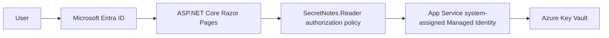

# Architecture

## Logical architecture

Secret Notes Viewer Lite is planned as a small ASP.NET Core Razor Pages application hosted on Azure App Service. It authenticates users with a single Microsoft Entra ID tenant, authorizes access to `/Notes` with the conceptual `SecretNotes.Reader` app role, and retrieves a closed catalog of synthetic demonstration note secrets from Azure Key Vault by using the App Service system-assigned Managed Identity.

The human user never accesses Azure Key Vault directly. The web application is the policy enforcement point for user authorization, and the Managed Identity is the workload identity that calls Key Vault.

## Actors and Azure components

- **User:** A human browser user who may be anonymous, authenticated without the app role, or authenticated with `SecretNotes.Reader`.
- **Microsoft Entra ID:** The single-tenant identity provider for user authentication and app-role claims.
- **ASP.NET Core Razor Pages:** The planned web application and user authorization enforcement point.
- **Azure App Service:** The planned hosting platform for the Razor Pages application.
- **System-assigned Managed Identity:** The workload identity attached to App Service and used by the application to authenticate to Azure Key Vault.
- **Azure Key Vault:** The planned secret store for synthetic demonstration note values.
- **Azure RBAC:** The authorization system used to grant the Managed Identity data-plane access to Key Vault secrets.

## Authentication flow

1. The user requests the application.
2. The application redirects unauthenticated users to Microsoft Entra ID.
3. Microsoft Entra ID authenticates the user in the configured single tenant.
4. The application receives and validates the authentication result through Microsoft.Identity.Web.

Authentication proves who the human user is. It does not grant direct Key Vault access.

## Authorization flow

1. A user requests `/Notes`.
2. The application evaluates an authorization policy that requires the `SecretNotes.Reader` app role.
3. Anonymous users are challenged to sign in.
4. Authenticated users without the app role are denied.
5. Authenticated users with `SecretNotes.Reader` may use the application feature that displays approved synthetic notes.

The app role authorizes the user to use the application feature only. It does not authorize the user to call Key Vault.

## Key Vault access flow

1. The `/Notes` page selects a secret from an application-owned, closed catalog of known secret names.
2. The application creates an Azure SDK `SecretClient` using `DefaultAzureCredential`.
3. In Azure App Service, `DefaultAzureCredential` uses the system-assigned Managed Identity.
4. Azure Key Vault authorizes the Managed Identity through Azure RBAC.
5. The Managed Identity is expected to receive only the `Key Vault Secrets User` role scoped as narrowly as practical.
6. The application displays only the intended synthetic note value and never logs, echoes, or stores the secret value elsewhere.

Users must not provide arbitrary secret names, query strings, or route values that are passed to Key Vault.

## Trust boundaries

- **Browser to application:** Untrusted user input crosses into the application and must be validated.
- **Application to Microsoft Entra ID:** Authentication depends on configured tenant and application registration metadata.
- **Application authorization boundary:** `/Notes` requires `SecretNotes.Reader` before any note retrieval is attempted.
- **Application to Azure Key Vault:** Only the workload identity crosses this boundary; the human user's token is not used for Key Vault access.
- **Operational evidence boundary:** Screenshots, logs, terminal output, Issues, and pull requests must not contain secret values or sensitive identifiers.

## Human identity vs. workload identity

Human identity and workload identity are intentionally separate:

- The human identity authenticates to the application with Microsoft Entra ID.
- The human identity is authorized inside the application with `SecretNotes.Reader`.
- The App Service Managed Identity authenticates the workload to Azure Key Vault.
- Azure RBAC authorizes the Managed Identity, not the human user, to read approved secrets.

## Planned Azure resources

- Azure Resource Group.
- Azure App Service Plan sized for low-cost learning usage.
- Azure App Service with a system-assigned Managed Identity.
- Azure Key Vault configured for Azure RBAC.
- Optional Application Insights or Log Analytics later, with moderate sampling and strict secret-redaction rules.

## Non-sensitive application configuration

Permitted configuration values are limited to non-sensitive settings such as environment name, Key Vault URI, known synthetic note labels, and feature flags. Real secrets, credentials, tokens, tenant IDs, subscription IDs, client IDs, personal data, connection strings, and realistic secret values must not be stored in source control or App Settings.

## Architectural restrictions

- No direct user access to Azure Key Vault.
- No arbitrary secret-name lookup, enumeration, wildcard reads, or user-controlled Key Vault identifiers.
- No storage of secret values in source control, App Settings, logs, exceptions, telemetry, URLs, screenshots, videos, Issues, pull requests, or terminal evidence.
- No application code, tests, infrastructure, scripts, workflows, deployment configuration, Azure resources, or Entra ID resources are part of this milestone.
