# Architecture

## Logical architecture

Secret Notes Viewer Lite is a small ASP.NET Core Razor Pages application with a repository-defined, owner-gated Azure App Service hosting foundation. It authenticates users with a single Microsoft Entra ID tenant and authorizes access to `/Notes` with the configured `SecretNotes.Reader` app role. The application owns a closed catalog of logical note identifiers and display names. The eventual deployed application will resolve those logical identifiers to synthetic demonstration note secrets in Azure Key Vault by using the App Service system-assigned Managed Identity.

The application user never accesses Azure Key Vault directly. The web application is the policy enforcement point for user authorization. B4-D8 local mode uses the separately authorized Azure CLI development identity as the Key Vault caller; a future deployed application will use a workload identity.

### Deferred application target state

The complete diagram below remains the deferred application target state. B4-D7 infrastructure is owner-validated, B4-D8 is merged, and B4-D9 has deployed and owner-validated an empty App Service host and its system-assigned identity. B4-D10A prepares the repository-local GitHub OIDC deployment foundation, but its Azure identity, RBAC, GitHub Environment, workflow run, and application publication remain owner-run and are not yet claimed. Workload credential composition, cloud browser authentication, Key Vault application RBAC, and telemetry remain deferred.



```mermaid
flowchart LR
    subgraph Browser[Browser / user trust boundary]
        User[Human user]
    end

    subgraph Entra[Microsoft Entra ID trust boundary]
        SignIn[Single-tenant sign-in]
        Claims[Authenticated user claims and app roles]
    end

    subgraph AppService[Azure App Service application trust boundary]
        App[ASP.NET Core Razor Pages]
        AuthN[Validate authenticated user]
        AuthZ[Authorize /Notes with SecretNotes.Reader]
        Catalog[Select approved logical note identifier]
        SecretClient[SecretClient using DefaultAzureCredential]
        MI[System-assigned Managed Identity]
    end

    subgraph KeyVault[Azure Key Vault data-plane trust boundary]
        RBAC[Azure RBAC authorizes Managed Identity]
        Secret[Approved synthetic secret]
    end

    User -->|authenticate| SignIn
    SignIn --> Claims
    Claims -->|token for application only| App
    App --> AuthN --> AuthZ
    AuthZ -->|authorized request| Catalog --> SecretClient
    SecretClient -->|workload authentication| MI
    MI -->|read secret| RBAC --> Secret
    Secret -->|secret value returned to application| SecretClient
```

## Implemented B4-D6 flow

Microsoft Entra authentication, OpenID Connect Authorization Code Flow, PKCE, and the B4-D5 authorization boundary remain implemented. B4-D6 moves the catalog and synthetic content out of Razor markup:

```text
Browser
→ Microsoft Entra authentication
→ ASP.NET Core authenticated principal
→ ReadSecretNotes policy
→ SecretNotes.Reader role requirement
→ Notes PageModel
→ IReadNotesService
→ ClosedNoteCatalog
→ INoteContentProvider
→ InMemoryNoteContentProvider
→ NoteItem models
→ Razor rendering
```

`ReadSecretNotes` requires `SecretNotes.Reader`. Anonymous requests to `/Notes` are challenged, authenticated users without the required role are forbidden, and authenticated users with the role can execute the notes service and render the fixed catalog. The authenticated Notes navigation link is a convenience, not the authorization boundary; the server-side PageModel policy is the boundary.

`ClosedNoteCatalog` owns membership, order, and display names. `ReadNotesService` requests content only for those definitions, and `INoteContentProvider` accepts only the closed `NoteId` value type. The provider cannot enumerate notes, raw identifier strings never reach it, and Razor accepts no identifier input. Logical IDs are not physical Key Vault names. Operational scripts reject any physical name equal, case-insensitively, to any public logical `NoteId`.

The Notes PageModel applies zero-duration, no-location, no-store response-cache behavior. Query strings cannot alter or expand the catalog. Integration tests exercise the boundary with non-identifying synthetic principals only. The synthetic authentication scheme exists only in the integration-test assembly, and production contains no test authentication bypass or test-header handling.

## Implemented B4-D7 infrastructure boundary

B4-D7 adds repository-backed infrastructure without changing the application flow:

```text
Subscription-scope main.bicep
→ dedicated development Resource Group
→ Standard Key Vault in West Europe
→ optional individual-user Key Vault Secrets User assignment at vault scope
```

Bicep is the source of truth for persistent state. All six owner-run workflows are focused PowerShell scripts because even preflight, `what-if`, and deployment contain validation and control flow. PowerShell also owns local identity resolution, bounded RBAC propagation retries, value comparison, failure sanitization, cleanup attempts, and cleanup-state validation. `.azcli` is reserved for genuinely linear Azure CLI scrapbooks. The implementation intentionally favors readable, independent scripts and small local duplication over a shared automation framework.

Before execution, the repository owner privately selects and verifies the intended Azure CLI active subscription. Each script captures that active subscription once without printing it and does not change the Azure CLI context. The local `.bicepparam` links to `main.bicep` with `using '../main.bicep'` and is the complete deployment parameter source. The deployment workflows therefore pass only `--parameters`; they do not combine the linked file with `--template-file` or an inline principal override. Bicep resolves the deployment identity through `deployer().objectId`, so the optional final human reader role targets the identity executing the final deployment.

The owner-run sequence is intentionally two phase. The first deployment disables the final reader assignment, allowing the denial script to prove that control-plane creation does not imply Key Vault data-plane access. Normal bootstrap then grants the signed-in user `Key Vault Secrets Officer` temporarily at the individual vault, requires an empty vault, creates exactly three synthetic secrets, validates them, and attempts to remove that role in `finally`. It remains intentionally non-idempotent. An explicit `-ResumeExistingSecrets` path handles only the exact partial state containing the three supplied active names: it creates no version and performs no secret write, update, deletion, or purge before using the shared read-only validation. The script succeeds only when a complete direct vault-scope query validates that the temporary assignment is absent. The second deployment enables the deterministic, persistent `Key Vault Secrets User` assignment for the deployment identity at the same vault scope. The owner must maintain the same signed-in identity across both deployments, bootstrap, recovery, and final validation.

Direct vault-scoped assignments and inherited effective permissions are separate security facts. Direct-state checks remain global across principals: they query `--scope <vault-scope>` without `--all` or `--include-inherited` and filter the exact scope locally so milestone-created Officer and application-identity assignments cannot be hidden by a principal filter. Final inherited-access validation uses the same vault scope with the current user's object ID, transitive-group expansion, and inherited-assignment inclusion, also without `--all`. It rejects effective inherited Key Vault data-plane actions as an unsupported least-privilege precondition; unrelated inherited assignments for other principals do not represent that user's effective access.

The vault definition enables Azure RBAC, purge protection, seven-day soft-delete retention, and public network access. Public access is a documented development exception for local validation, not a production network design.

`00-preflight.ps1` validates both `main.bicep` and the ignored local `.bicepparam`. The final owner-run path completed successfully: initial deployment, negative data-plane validation, write-free partial-bootstrap recovery, temporary Officer cleanup, final reader deployment, and final vault/secret/RBAC validation all passed. Historical corrections kept the linked `.bicepparam` self-contained, removed incompatible `--all` plus `--scope` role queries, added explicit write-free partial-bootstrap recovery, preserved JSON timestamps with `-DateKind String`, and moved secret-version counting from `length(@)` into PowerShell.

Scripts 04 and 05 suppress raw Azure diagnostics while preserving script-generated sanitized failure reasons and coarse markers. B4-D7 Azure state is owner-validated.

## Implemented B4-D8 local provider boundary

The committed default remains entirely local:

```text
ClosedNoteCatalog
→ ReadNotesService
→ INoteContentProvider
→ InMemoryNoteContentProvider
```

An explicit startup selection enables the local Key Vault path:

```text
Authorized /Notes request
→ Notes PageModel
→ IReadNotesService
→ ClosedNoteCatalog
→ INoteContentProvider
→ KeyVaultNoteContentProvider
→ singleton SecretClient
→ AzureCliCredential
→ development Key Vault
```

Provider selection occurs once during composition and supports only `InMemory` and `KeyVault`. In-memory mode does not bind Key Vault options or register Azure SDK services. Key Vault mode validates the vault URI and three closed physical-name fields at startup, registers one reusable client, and never registers or falls back to the in-memory adapter.

`ClosedNoteCatalog` remains the sole source of membership and order. `KeyVaultNoteContentProvider` owns an exhaustive code mapping from the three `NoteId` values to the three configured physical names. It issues only `GetSecretAsync` for the active version, performs no enumeration or caching, and converts expected Azure or unavailable-value failures to a fixed application exception without retaining raw diagnostics. Automated tests replace `SecretClient` through its protected constructor and virtual read method, so they require no Azure login, network, CLI execution, User Secrets, or additional production abstraction.

Owner-run local validation completed successfully. Explicit `KeyVault` composition started with `AzureCliCredential` using the previously validated development identity, and the closed three-note catalog resolved through the reusable `SecretClient`. Arbitrary query input did not alter membership, order, or secret selection; application authorization and no-store behavior remained intact; and no sensitive rendering or logging was observed. Explicitly selecting `InMemory` again restored Azure-independent operation. This local caller remains the server-side Azure CLI development identity; the deployed App Service system-assigned Managed Identity exists but remains a deferred Key Vault caller.

## Owner-validated B4-D9 hosting boundary

B4-D9 deploys only the hosting foundation, while the repository definition remains gated by `provisionAppServiceHosting = false` by default:

```text
Existing development Resource Group
├── existing Standard Key Vault and development-user role state (unchanged)
├── Linux App Service Plan (F1 / Free)
└── empty Linux Web App
    ├── DOTNETCORE|10.0
    ├── HTTPS-only and TLS 1.2 minimum
    ├── public network access enabled and client affinity disabled
    ├── FTP/FTPS and SCM/FTP basic publishing disabled
    └── system-assigned Managed Identity without Key Vault authorization
```

The plan module and Web App module share only the existing Resource Group scope and tags. The Web App depends on the plan resource ID; neither hosting module depends on Key Vault, and Key Vault does not depend on hosting. No application package, App Settings, connection strings, Key Vault reference, authentication configuration, telemetry, slot, networking integration, or deployment mechanism is defined.

The stable `Microsoft.Web/serverfarms@2025-03-01`, `Microsoft.Web/sites@2025-03-01`, and `Microsoft.Web/sites/basicPublishingCredentialsPolicies@2025-03-01` schemas represent all required properties. Owner-run deployment and post-deployment validation completed successfully. The validated state is one Linux F1 / Free plan and one empty Linux Web App using `DOTNETCORE|10.0`, with HTTPS-only, site and SCM TLS 1.2, disabled FTP/FTPS and basic publishing credentials, enabled public network access, disabled client affinity, and one system-assigned Managed Identity. Validation also proved that no direct Key Vault role, App Setting, connection string, application package, repository-defined deployment artifact, Application Insights resource, or Log Analytics workspace was introduced.

## Actors and Azure components

- **User:** A human browser user who may be anonymous, authenticated without the app role, or authenticated with `SecretNotes.Reader`.
- **Microsoft Entra ID:** The single-tenant identity provider for user authentication and app-role claims.
- **ASP.NET Core Razor Pages:** The planned web application and user authorization enforcement point.
- **Azure App Service:** The deployed and owner-validated empty hosting platform for the future Razor Pages publication; B4-D9 creates no application package.
- **System-assigned Managed Identity:** The identity created with the deployed Web App. Its existence is not authorization, and B4-D9 grants it no Key Vault permission.
- **GitHub deployment identity:** A dedicated App Registration and Service Principal prepared by B4-D10A for GitHub OIDC. When owner-created, its only accepted direct assignment in the active subscription is `Website Contributor` at the exact Web App scope. It is not the browser application or runtime Managed Identity.
- **Azure Key Vault:** The deployed and validated B4-D7 development secret store; completed B4-D8 owner-run validation proved that explicitly selected local mode can read its closed synthetic note set.
- **Azure RBAC:** The authorization system used to grant the Managed Identity data-plane access to Key Vault secrets.

## Development identity bootstrap

The development identity metadata and local application authentication are implemented:

- **Application object / App Registration:** The development-specific `Secret Notes Viewer Lite - Development` App Registration defines the single-tenant identity-platform configuration, localhost HTTPS callbacks, `SecretNotes.Reader` app role, ownership, and credential registrations. One short-lived development-only client credential supports the local confidential-client flow; no API permission is configured.
- **Service principal / Enterprise Application:** The corresponding Enterprise Application represents the application in the tenant. Assignment is required, it is hidden from My Apps, and it holds tenant-local assignments.
- **Human authorization:** One individual human user is assigned to the `Secret Notes Reader` role for development validation. The implemented `ReadSecretNotes` policy uses that app-role value to authorize the `/Notes` fixed synthetic shell.
- **Deployed workload identity:** The App Service system-assigned Managed Identity will call Azure Key Vault only after B4-D11 adds workload composition and minimum RBAC. Neither the assigned human user nor the human user's Entra token is the deployed Key Vault caller.

The existing registration is development-specific and contains localhost HTTPS endpoints only. A separate production App Registration will be created in a future deployment milestone. Production App Service endpoints must not be added to the development registration, and development and production credential lifecycles must remain separate.

## Implemented authentication flow

1. The user requests the application.
2. The application redirects unauthenticated users to Microsoft Entra ID.
3. Microsoft Entra ID authenticates the user in the configured single tenant.
4. The application receives and validates the authentication result through Microsoft.Identity.Web.

Authentication proves who the human user is. It does not grant direct Key Vault access.

## Implemented authorization flow

1. A user requests `/Notes`.
2. The application evaluates the `ReadSecretNotes` authorization policy, which requires the `SecretNotes.Reader` app role.
3. Anonymous users are challenged to sign in.
4. Authenticated users without the app role are denied.
5. Authenticated users with `SecretNotes.Reader` may execute the notes service and render the fixed synthetic catalog.

The app role authorizes the user to use the application feature only. It does not authorize the user to call Key Vault.

## Deferred deployed Key Vault access flow

1. `ClosedNoteCatalog` supplies an application-owned logical `NoteId`.
2. The implemented `INoteContentProvider` adapter maps that logical ID to a physical Key Vault name.
3. Deployed composition will create an Azure SDK `SecretClient` using the future workload credential decision.
4. In Azure App Service, `DefaultAzureCredential` uses the system-assigned Managed Identity.
5. Azure Key Vault authorizes the Managed Identity through Azure RBAC.
6. The Managed Identity is expected to receive only the `Key Vault Secrets User` role scoped as narrowly as practical.
7. The application displays only the intended synthetic note value and never logs, echoes, or stores the secret value elsewhere.

Users must not provide arbitrary secret names, query strings, or route values that are passed to Key Vault.

## Trust boundaries

- **Browser to application:** Untrusted user input crosses into the application and must be validated.
- **Application to Microsoft Entra ID:** Authentication depends on configured tenant and application registration metadata.
- **Application authorization boundary:** `/Notes` requires the `ReadSecretNotes` policy and its `SecretNotes.Reader` role requirement before the notes service executes.
- **Application service boundary:** The PageModel accepts no identifier input. `ReadNotesService` reads only `ClosedNoteCatalog`, and the provider accepts only known logical `NoteId` values.
- **Application to Azure Key Vault:** In B4-D8 local mode, the server-side Azure CLI development identity crosses this boundary. In the B4-D11 deployed state, the App Service workload identity will cross it. The browser user's token never crosses this boundary.
- **Operational evidence boundary:** Screenshots, logs, terminal output, Issues, and pull requests must not contain secret values or sensitive identifiers.

## Human identity vs. workload identity

Human identity and workload identity are intentionally separate:

- The human identity authenticates to the application with Microsoft Entra ID.
- The human identity is authorized inside the application with `SecretNotes.Reader`.
- The deployed App Service Managed Identity will authenticate the workload to Azure Key Vault only after B4-D11 enables that path.
- Azure RBAC will authorize the Managed Identity, not the human user, to read approved secrets.
- B4-D7 uses the local developer identity only for manual bootstrap and validation: temporary `Key Vault Secrets Officer`, followed by persistent `Key Vault Secrets User`, both at the individual development vault.
- B4-D8 local Key Vault mode uses `AzureCliCredential` deterministically, so the same Azure CLI identity was the runtime Key Vault caller during completed owner-run validation.
- No application identity or Managed Identity role assignment is introduced by B4-D7.

## Azure resource status

- Development Resource Group and Standard Key Vault: deployed and validated for B4-D7, including the final individual reader role, exact three-secret state, and absence of temporary or application-identity vault assignments.
- Azure App Service Plan: one deployed and owner-validated Linux F1 / Free plan, still repository-defined behind the default-off gate.
- Azure Web App with system-assigned Managed Identity: one deployed and owner-validated empty Linux Web App; no application package and no Key Vault role.
- Application Insights and Log Analytics: planned and deferred, with conservative telemetry, sampling, retention, and cost controls required by a later milestone.

The milestone order preserves identity separation. B4-D10A prepares the dedicated GitHub deployment identity and manual-only OIDC workflow. B4-D10B creates the separate cloud browser App Registration, adds cloud redirect and logout URIs, supplies minimum non-secret runtime configuration, publishes with `Provider=InMemory`, and validates deployed authentication plus `SecretNotes.Reader` authorization. B4-D11 then adds the vault-scoped `Key Vault Secrets User` assignment for the Web App identity, `Provider=KeyVault`, and deployed closed-catalog reads.

## Non-sensitive application configuration

Non-secret deployment identifiers may be supplied as runtime configuration, including through Azure App Service configuration. These include tenant ID, application/client ID, Key Vault URI, environment name, and feature flags. Logical note identifiers are centralized in the application-owned `NoteId` type and are not configuration-driven. Real identifier values should still not be unnecessarily published in README files, Issues, pull requests, screenshots, videos, or terminal evidence. Sensitive values such as client secrets, passwords, access tokens, refresh tokens, credentials, secret values, sensitive connection strings, and personal data must never be committed or exposed.

## Architectural restrictions

- No direct user access to Azure Key Vault.
- No arbitrary secret-name lookup, enumeration, wildcard reads, or user-controlled Key Vault identifiers.
- No storage of secret values in source control, App Settings, logs, exceptions, telemetry, URLs, screenshots, videos, Issues, pull requests, or terminal evidence.
- B4-D6 implements the closed logical catalog, application service, in-memory content provider, model-driven Razor rendering, no-store behavior, and unit/integration tests. It changes no infrastructure, deployment configuration, Azure resources, Entra ID resources, telemetry, or CI/CD.
- B4-D7 changes repository infrastructure and operational evidence only. It performs no application, Entra ID, App Service, Managed Identity, telemetry, or CI/CD integration.
- B4-D8 adds only the optional local Key Vault adapter, Azure-free tests, operational guidance, and sanitized owner-run validation evidence. It performs no Azure mutation and adds no App Service, Managed Identity, telemetry, or CI/CD integration.
